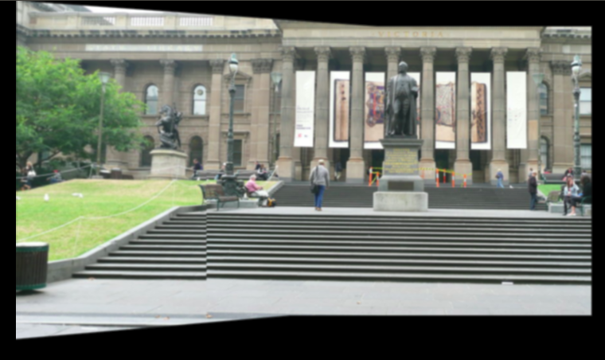
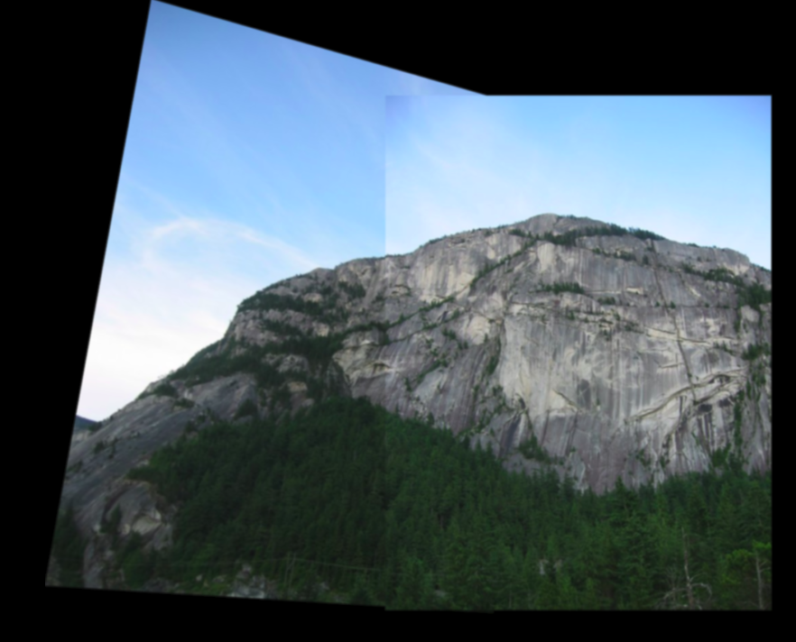
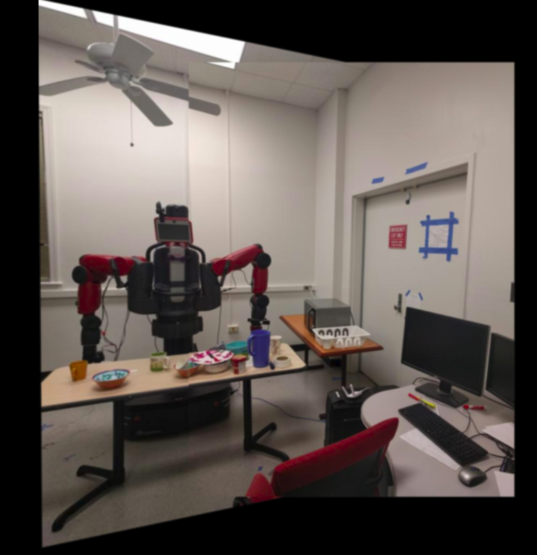
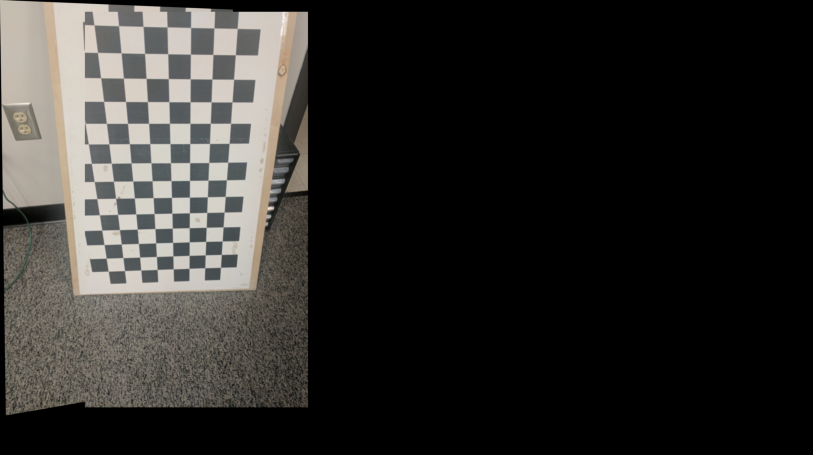
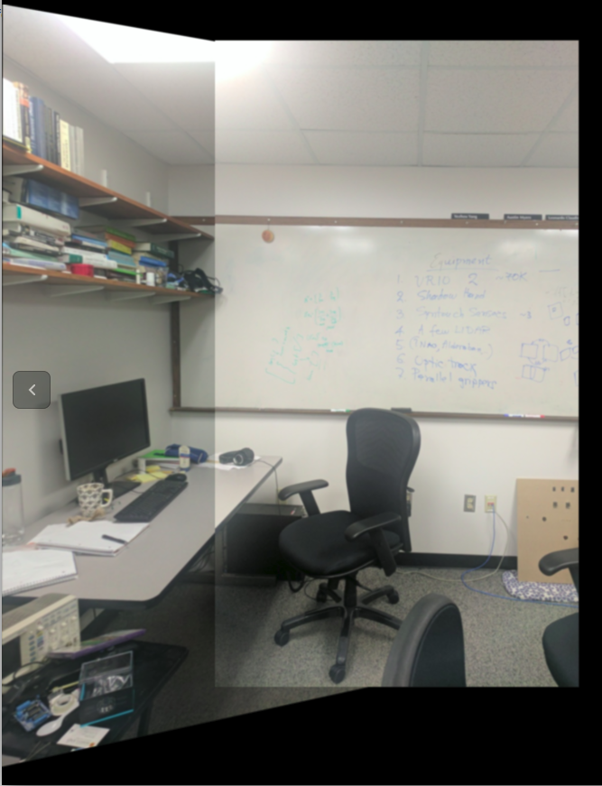
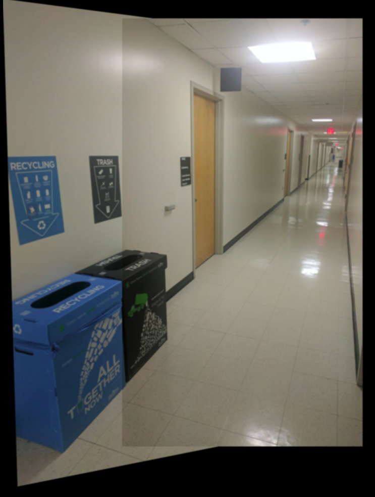
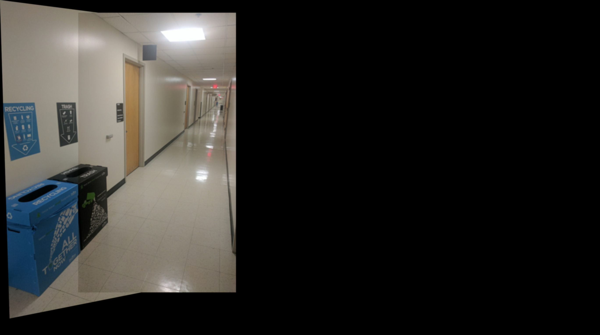
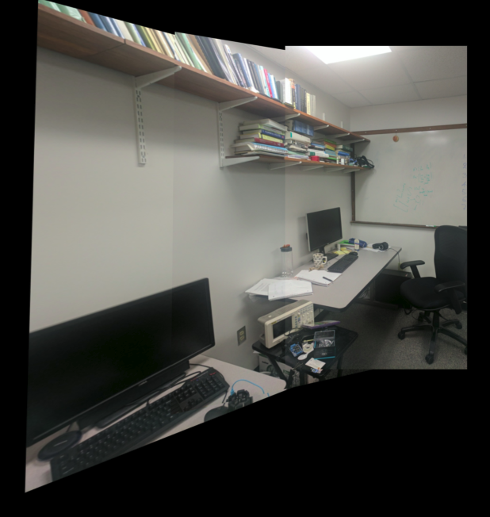

Implementations of panorama stitching.

Steps to run the phase 1 code:

    cd ../Phase1/Code
    python Wrapper.py --BasePath test_data

Steps to run Phase2 Code:

    cd ../Phase2/
    Copy MSCOCO Data folder
    cd Code/
    python Train.py --ModelType 

#Results

