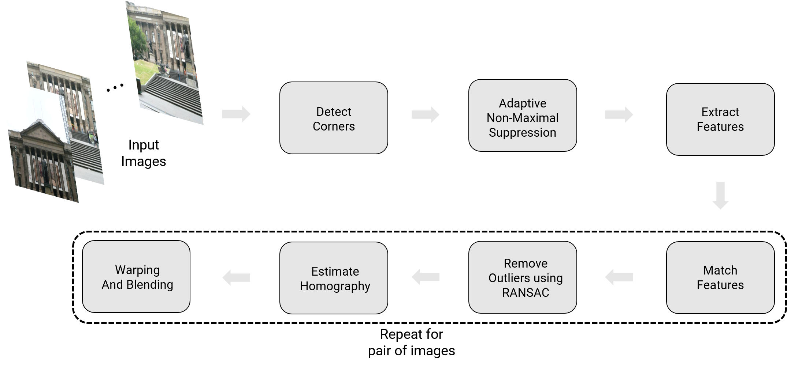
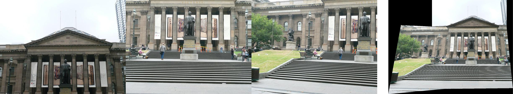
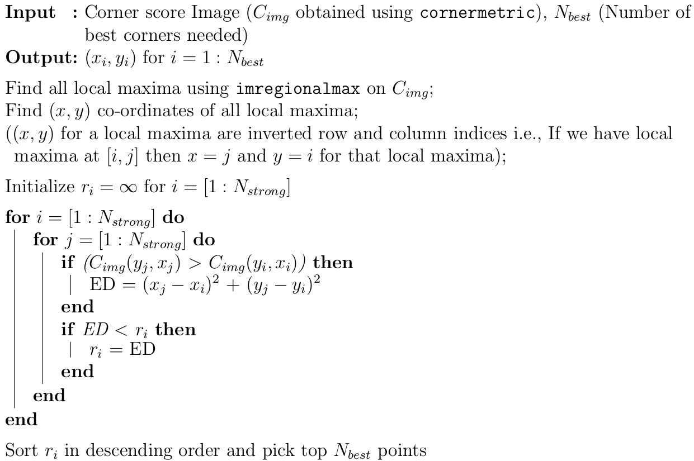
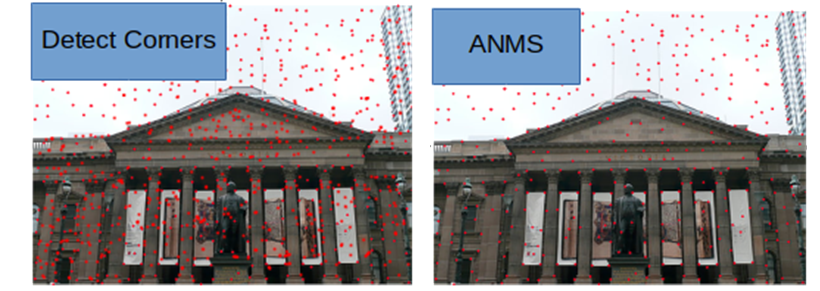
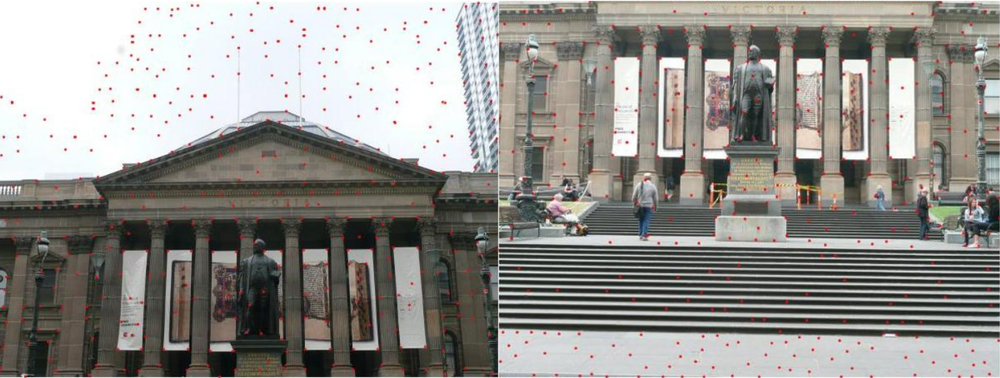
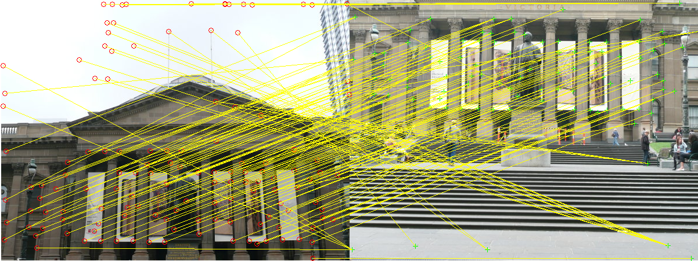
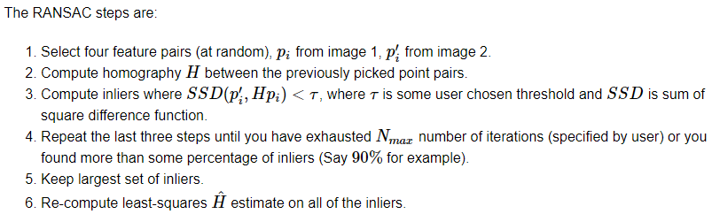

Implementations of panorama stitching.

Steps to run the phase 1 code:

    cd ../Phase1/Code
    python Wrapper.py --BasePath test_data

Steps to run Phase2 Code:

    cd ../Phase2/
    Copy MSCOCO Data folder
    cd Code/
    python Train.py --ModelType 

# Traditional approach

Sample input images and it’s respective output are shown below.

## Corner Detection
The first step in stitching a panorama is extracting corners like most
computer vision tasks. One can use either Harris corners or Shi-Tomasi
corners.

## Adaptive Non-Maximal Suppression (ANMS)
The objective of this step is to detect corners such that they are
equally distributed across  the image in order to avoid weird artifacts
in warping.

In a real image, a corner is never perfectly sharp, each corner might
get a lot of hits out of the N strong corners - we want to choose only
the Nbest best corners after ANMS. In essence, you will get a lot more
corners than you should! ANMS will try to find corners which are true
local maxima. The algorithm for implementing ANMS is given below.

Output of corner detection and ANMS is shown below. Observe that the output of ANMS is evenly distributed strong corners.

A sample output of ANMS for two different images are shown below.

## Feature Descriptor
In the previous step, you found the feature points  (locations of the
Nbest best corners after ANMS are called the feature point locations).
You need to describe each feature point by a feature vector, this is
like encoding the information at each feature point by a vector. One of
the easiest feature descriptor is described next.

Take a patch of size 40×40 centered (this is very important) around the
keypoint/feature point. Now apply gaussian blur (feel free to play
around with the parameters, for a start you can use OpenCV’s default
parameters in cv2.GaussianBlur command. Now, sub-sample the blurred
output (this reduces the dimension) to 8×8. Then reshape to obtain a
64×1 vector. Standardize the vector to have zero mean and variance of 1.
Standardization is used to remov e bias and to achieve some amount of
illumination invariance.

## Feature Matching
In the previous step, you encoded each keypoint by 64×1 feature vector.
Now, you want to match the feature points among the two images you want
to stitch together. In computer vision terms, this step is called as
finding feature correspondences between the 2 images. Pick a point in
image 1, compute sum of square differences between all points in image
2\. Take the ratio of best match (lowest distance) to the second best
match (second lowest distance) and if this is below some ratio keep the
matched pair or reject it. Repeat this for all points in image 1. You
will be left with only the confident feature correspondences and these
points will be used to estimate the transformation between the 2 images,
also called as Homography. Use the function cv2.drawMatches to visualize
feature correspondences. Below is an image showing matched features.

## RANSAC for outlier rejection and to estimate Robust Homography

We now have matched all the features correspondences but not all matches
will be right. To remove incorrect matches, we will use a robust method
called Random Sample Concensus or RANSAC to compute homography.

##  Blending Images
When blending these images, there are inconsistency between pixels from
different input images due to different exposure/white balance settings
or photometric distortions or vignetting. This can be resolved by
Poisson blending. Feel free to use any built-in or third party code for
Poisson blending to obtain pretty results.

An input and output of a seamless panorama of three images are shown below.

# Results

